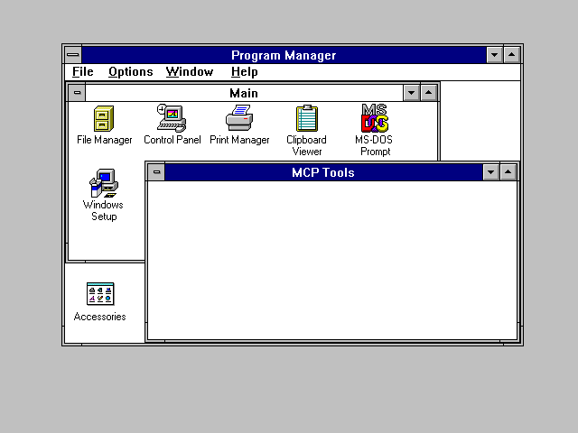
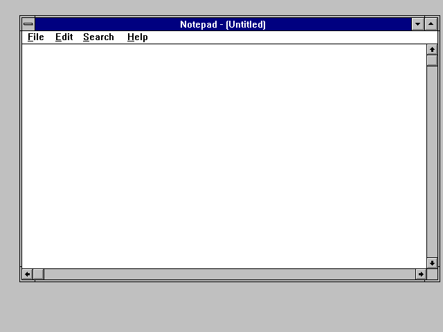
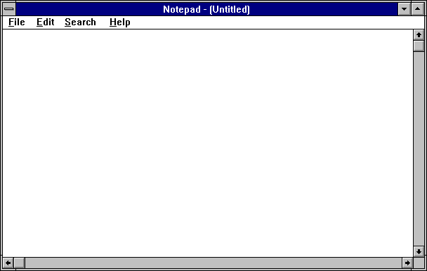

# Legacy MCPs

Remote control agents for DOS and Windows 3.x, driven from a modern host via file-based IPC.



## What is this?

Two small programs that run inside vintage operating systems and expose their APIs to the outside world:

- **[dos-mcp](dos-mcp/)** — A DOS TSR (Terminate and Stay Resident) program written in 8086 assembly. Hooks the timer interrupt, polls for commands, executes them via DOS/BIOS interrupts, and writes responses back. 153 passing tests.

- **[win-mcp](win-mcp/)** — A Win16 application written in C (Open Watcom). Runs as a hidden window inside Windows 3.x, polls for commands via a timer, executes them via the Windows API, and writes responses back. 75 passing tests.

Both use the same protocol: the host writes a command to a text file, the agent reads it, executes it, and writes a response to another text file. No network stack, no sockets, no shared memory — just files. This works because the "files" live on a shared drive (SMB mount, DOSBox-X host directory mount, or emu2 drive mapping).

## Architecture

```
Host (macOS)                         Guest (DOS / Windows 3.x)
─────────────                        ─────────────────────────
                  shared directory
Test harness ──→ _MAGIC_/__MCP__.TX ──→ DOSMCP.COM (DOS TSR)
             ←── _MAGIC_/__MCP__.RX ←──   reads via INT 21h
                                          writes via INT 21h

Test harness ──→ _MAGIC_/__WIN__.TX ──→ WINMCP.EXE (Win16 app)
             ←── _MAGIC_/__WIN__.RX ←──   reads via OpenFile
                                          writes via _lwrite
```

The two agents run independently and simultaneously. The DOS TSR handles real-mode operations (memory, ports, BIOS, files, keyboard). The Win16 app handles protected-mode Windows operations (windows, messages, tasks, GDI, DDE, clipboard, GUI automation).

## Quick start

### Build and test (Win16 — requires display)

```bash
cd win-mcp
make testwin    # Builds WINMCP.EXE, boots Windows 3.1 in DOSBox-X, runs 75 tests
```

### Build and test (DOS — headless)

```bash
cd dos-mcp
make test       # Assembles DOSMCP.COM, runs in emu2, runs 153 tests
```

### Requirements

- **nasm** — assembler for dos-mcp
- **node** — test harness runtime
- **tools/watcom/** — Open Watcom 2.0 (cross-compiles Win16 from macOS ARM64)
- **tools/emu2** — patched DOS emulator for headless testing
- **tools/dosbox-x** — patched DOSBox-X for GUI/Windows testing

See [PATCHES.md](PATCHES.md) for details on the DOSBox-X and emu2 modifications.

## IPC Protocol

Both agents use the same protocol:

1. Host writes a command string to `__WIN__.TX` (or `__MCP__.TX`)
2. Agent polls, reads the file, deletes it
3. Agent dispatches the command to the appropriate handler
4. Agent writes a response string to `__WIN__.RX` (or `__MCP__.RX`)
5. Host reads the response, deletes it

**Responses** start with `OK` (success) or `ERR` (failure):

```
OK PONG
OK WINMCP/0.3 META,PROFILE,FILE,DIR,...
OK W=640 H=480 BPP=8
ERR NOT_FOUND
ERR INVALID_HWND
```

**Status file** (`__WIN__.ST` / `__MCP__.ST`) contains `READY` when the agent has initialized and is polling.

**Atomic writes:** The host writes to a temp file first, then renames it to the TX path. This prevents the agent from reading a partially-written command.

## Command overview

### DOS MCP — 22 command families, 80+ commands, 153 tests

| Family | Commands | What it does |
|---|---|---|
| META | PING, VERSION, STATUS, HEARTBEAT, LOG, LASTERROR, UNLOAD, REPEAT, DELAY, BATCH | Lifecycle, diagnostics, batching |
| MEM | PEEK, POKE, READ, WRITE, DUMP, FILL, COPY, SEARCH, FREE, MCB, EMS, XMS | Memory access, search, allocation info |
| PORT | IN, OUT | x86 I/O port access |
| CON | READ, WRITE, CURSOR, COLOR, MODE, ATTR, REGION, CLEAR, SCROLL, INPUT, FIND, BOX, CRC | Console/text-mode screen |
| GFX | PIXEL, PALETTE GET/SET, VESA MODE/INFO | Graphics, VGA palette, VESA info |
| SCREEN | DUMP | Text-mode screen dump to file |
| MOUSE | MOVE, CLICK, DBLCLICK, DOWN, UP, DRAG | INT 33h mouse driver |
| KEY | SEND, TYPE, HOTKEY, DOWN, UP, FLUSH, PEEK | Keyboard input, modifiers, combos |
| WAIT | SCREEN, GONE, SLEEP, PIXEL, CRC | Wait for screen content, timing |
| FILE | READ, WRITE, APPEND, DELETE, RENAME, COPY, EXISTS, SIZE, TIME, FIND, ATTR, WATCH | Full file I/O with metadata and change detection |
| DIR | LIST, MAKE, CHANGE, GET, DRIVES | Directory operations with drive listing |
| DISK | FREE | Disk space query |
| EXEC | SHELL, RUN, EXIT, LIST | Run programs, get exit codes, list processes |
| TIME | GET, SET | Date/time read and write |
| INI | READ, WRITE | INI file access |
| CLIP | GET, SET | DOS clipboard (INT 2Fh) |
| CMOS | READ, WRITE | CMOS/RTC register access |
| ENV | GET, SET | Environment variables (read, write, delete) |
| SYS | INFO, MEMORY, DRIVERS, ANSI, BEEP, TONE, QUIET, REBOOT | System info, sound, reboot |
| INT | CALL, LIST, WATCH | Invoke interrupts, dump IVT, count interrupt fires |
| POWER | STATUS, IDLE, STANDBY, OFF | APM power management |
| TSR | LIST | List resident programs with sizes |

### Win16 MCP — 32 command families, 91 tests

| Family | Commands | What it does |
|---|---|---|
| META | PING, VERSION, STATUS, QUIT | Lifecycle and diagnostics |
| PROFILE | GET, SET, SECTIONS | Windows INI file access |
| FILE | READ, WRITE, APPEND, DELETE, COPY, FIND | File I/O via Windows API |
| DIR | CREATE, DELETE, LIST | Directory operations |
| TIME | GET | System time via DOS interrupt |
| ENV | GET | Environment variables |
| EXEC | (program) | Launch programs via WinExec |
| WINDOW | LIST, FIND, TITLE, CLOSE, MOVE, SHOW, RECT, VISIBLE, ENABLED | Window enumeration and control |
| TASK | LIST, KILL | Task management (ToolHelp API) |
| GDI | SCREEN, CAPTURE | Screen info + 24-bit BMP screenshots |
| MSG | SEND, POST | SendMessage / PostMessage with arbitrary params |
| CLIP | GET, SET | Clipboard text read/write |
| DIALOG | LIST, GET, SET, CLICK | Dialog control enumeration and manipulation |
| DDE | CONNECT, EXEC, CLOSE | Dynamic Data Exchange |
| TYPE | (text) | Text input via WM_CHAR with escape sequences |
| SENDKEYS | (keys) | Keyboard simulation with VK codes and modifiers |
| MOUSE | MOVE, CLICK, DBLCLICK, RCLICK, DRAG, RDRAG, GETPOS | Full mouse simulation |
| CLICK | (hwnd, id) | Button click via WM_COMMAND |
| MENU | (hwnd, id) | Menu command via WM_COMMAND |
| FOCUS | (hwnd) | SetFocus + BringWindowToTop |
| SCROLL | (hwnd, dir, n) | Scroll via WM_VSCROLL/WM_HSCROLL |
| CONTROL | FIND | Child window locator (Playwright-style) |
| LIST | SELECT | Listbox selection |
| COMBO | SELECT | Combobox selection |
| CHECK | (hwnd, id) | Set checkbox checked |
| UNCHECK | (hwnd, id) | Set checkbox unchecked |
| ABORT | | Dismiss foreground modal dialog |
| WAIT | WINDOW, GONE | Wait for window to appear/disappear |
| WAITFOR | (hwnd, id, text) | Wait for control text to match |
| EXPECT | (hwnd, id, text) | Immediate control text assertion |
| RECORD | START, STOP, SAVE | Journal recording via WINMCHK.DLL |
| PLAY | (file), STOP, STATUS | Journal playback with speed control |

## Scripting

The `lib/win-auto.js` library provides a Playwright-style async API for driving win-mcp from Node.js scripts:

```js
const { WinAuto } = require('./lib/win-auto');
const win = new WinAuto({ magicDir: './share/_MAGIC_' });
await win.waitForReady();

const notepad = await win.exec('NOTEPAD.EXE');
const edit = await notepad.locator('Edit');
await edit.type('Hello from 2026!');
await edit.selectAll();
await notepad.capture();
await notepad.close();
```

See [SCRIPTING.md](SCRIPTING.md) for the full API reference and [examples/minesweeper.js](examples/minesweeper.js) for a complete demo.

## Project structure

```
legacy-mcps/
├── README.md              This file
├── SCRIPTING.md           win-auto.js API reference
├── PATCHES.md             DOSBox-X and emu2 patch documentation
├── WIN-MCP.md             Original architecture design document
├── lib/
│   ├── win-auto.js        Node.js scripting library (Playwright-style)
│   └── win-compare.js     BMP screenshot comparison utility
├── examples/
│   └── minesweeper.js     Demo: automate Minesweeper
├── dos-mcp/               DOS TSR agent
│   ├── src/dosmcp.asm     Source (8086 NASM assembly)
│   ├── Makefile            Build + test targets
│   ├── test-harness.js     Node.js test runner (153 tests)
│   ├── dosbox-run.sh       DOSBox-X launcher
│   └── dosbox-test.conf    DOSBox-X config (TSR mode)
├── win-mcp/               Win16 agent
│   ├── src/winmcp.c       Source (C, Open Watcom)
│   ├── src/winmcp.def     Module definition
│   ├── src/Makefile        Watcom cross-compile
│   ├── Makefile            Build + test targets
│   ├── test-harness.js     Node.js test runner (91 tests, uses win-auto.js)
│   ├── dosbox-run.sh       DOSBox-X launcher
│   ├── dosbox-win31.conf   Windows 3.1 boot config
│   └── capture/            Screenshots from GDI CAPTURE
├── share/                 Shared IPC directory
│   └── _MAGIC_/           Command/response files live here
├── ref/                   Reference documentation
│   ├── 8086 and DOS internals (TSR, interrupts, memory)
│   └── Keyboard scancodes, BIOS data area, etc.
└── tools/                 Build tools (see PATCHES.md)
    ├── dosbox-x            Patched DOSBox-X binary
    ├── dosbox-x-src/       DOSBox-X source (GPL v2)
    ├── emu2                Patched emu2 binary
    ├── emu2-src/           emu2 source + mcp-patches.diff (GPL v2)
    ├── watcom/             Open Watcom 2.0 (cross-compiler)
    └── win31-hdd/          Minimal Windows 3.1 install for testing
```

## Screenshots

### GDI CAPTURE — Full desktop



### GDI CAPTURE — Active window (Notepad)



### Program Manager with MCP Tools group (created via DDE)


## License

The agent source code (dosmcp.asm, winmcp.c) is original work.

The patched tools (DOSBox-X, emu2) are GPL v2 — full source and diffs are included in `tools/`. See [PATCHES.md](PATCHES.md).

Open Watcom is distributed under the Sybase Open Watcom Public License.
