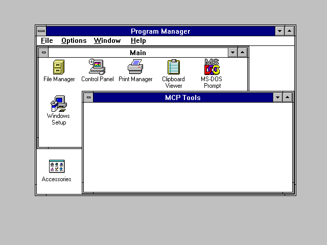
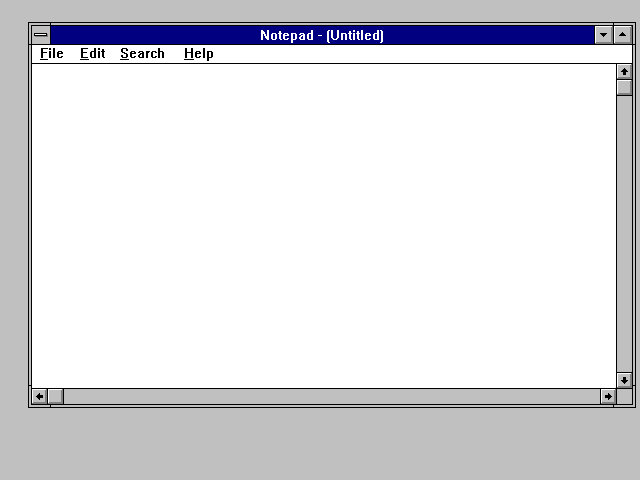
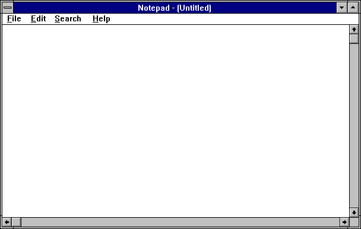

# Legacy MCPs

Remote control agents for DOS and Windows 3.x, driven from a modern host via file-based IPC.



## What is this?

Two small programs that run inside vintage operating systems and expose their APIs to the outside world:

- **[dos-mcp](dos-mcp/)** — A DOS TSR (Terminate and Stay Resident) program written in 8086 assembly. Hooks the timer interrupt, polls for commands, executes them via DOS/BIOS interrupts, and writes responses back.

- **[win-mcp](win-mcp/)** — A Win16 application written in C (Open Watcom). Runs as a hidden window inside Windows 3.x, polls for commands via a timer, executes them via the Windows API, and writes responses back.

Both use the same protocol: the host writes a command to a text file, the agent reads it, executes it, and writes a response to another text file. No network stack, no sockets, no shared memory — just files. This works because the "files" live on a shared drive (SMB mount, DOSBox-X host directory mount, or emu2 drive mapping).

The primary Windows host API is `lib/win-auto.js`, a Playwright-like controller.
The MCP agents do not require command-line interfaces. Optional thin adapters
in `bin/` expose the same library operations to interactive shells and CI;
they contain no independent automation implementation. Both normal mailbox
clients verify the live agent's reported source-contract identity against this
checkout before a command session. This compatibility check is not
authentication; the explicit post-guest-reset operation does not contact or
authenticate the guest.

- **[smb-share](smb-share/)** — A custom Node.js LAN Manager (LANMAN2.1) SMB server for connecting real or emulated Windows for Workgroups 3.11 machines to the host. Modern Samba won't negotiate down to the ancient dialect WFW uses — this purpose-built server does.

## Architecture

```
Host (macOS)                         Guest (DOS / Windows 3.x)
─────────────                        ─────────────────────────
                  shared directory
Test harness ──→ _MAGIC_/__MCP__.TX ──→ DOSMCP.COM (DOS TSR)
             ←── _MAGIC_/__MCP__.RX ←──   reads via INT 21h
                                          writes via INT 21h

Test harness ──→ _MAGIC_/__WIN__.TX ──→ WINMCP.EXE (Win16 app)
             ←── _MAGIC_/__WIN__.RX ←──   reads via OpenFile
                                          writes via _lwrite
```

The two agents run independently and simultaneously. The DOS TSR handles real-mode operations (memory, ports, BIOS, files, keyboard). The Win16 app handles protected-mode Windows operations (windows, messages, tasks, GDI, DDE, clipboard, GUI automation).

## Pre-built binaries

`DOSMCP.COM`, `WINMCP.EXE`, and `WINMCHK.DLL` are pre-built and available in [`share/`](share/) — no compiler needed to use them. Copy them into your DOS/Windows environment and run.

## Quick start

### Build and test (Win16 — headless guest run)

```bash
cd win-mcp
make testwin    # Builds WINMCP.EXE, boots Windows 3.1, runs the harness
```

### Build and test (DOS — headless)

```bash
cd dos-mcp
make test       # Assembles DOSMCP.COM and runs the headless harness in emu2
```

Both guest agents embed a SHA-256 identity over their declared source/build
contract. Their Makefiles refresh it automatically. Verify the checked headers
without building with:

```bash
node scripts/update-guest-tool-identities.js --check
node scripts/test-guest-tool-identities.js
```

The receipt identifies reviewed source and build recipes; it is not a claim of
bit-for-bit reproducibility across compilers or hosts.

### Optional host CLI quick start

```bash
node bin/winmcp.js status
node bin/winmcp.js windows
node bin/winmcp.js exec --wait-for Calculator -- CALC.EXE
node bin/winmcp.js exec --no-wait -- NOTEPAD.EXE README.TXT
node bin/winmcp.js sequence examples/win-sequences/health-check.json
node bin/dosmcp.js identity
node bin/dosmcp.js send -- SYS INFO
```

`exec` requires an explicit wait policy. The CLI joins the individual program
argument tokens, validates the resulting bounded printable command, and sends
it directly to WINMCP; the host does not invoke a shell. WINMCP commands are
limited to 511 printable ASCII bytes; DOSMCP commands are limited to 255.

Pass `--magic-dir /absolute/path/to/_MAGIC_` when the shared directory is not
the repository default. Before publishing a command, the clients create a
durable per-agent inflight marker. A timeout or interrupted client leaves that
mailbox uncertain across later client processes because a late response could
otherwise be mistaken for a later command. After externally replacing or
resetting the disposable guest, clear the retained state explicitly:

```bash
node bin/winmcp.js reset --confirm-guest-reset
node bin/dosmcp.js reset --confirm-guest-reset
```

The confirmation does not reset the guest. Reset holds the advisory host lease
and refuses a pending response or unconsumed request.

Optional diagnostic adapters also expose the checked DOSBox-X debugger,
deterministic reverse-step workflow, and receipt-backed Win16 memory snapshots:

```bash
node bin/dosbox-debugger.js status
node bin/dosbox-debugger.js reset --confirm-emulator-reset  # only after external reset
node bin/dosbox-reverse.js step clean-checkpoint 1
node bin/winmcp-snapshot.js capture examples/win-memory-snapshot.json snapshot.json
node bin/winmcp-snapshot.js diff before.json after.json diff.json
```

See [DOSBOX-DEBUGGER.md](DOSBOX-DEBUGGER.md) and [SCRIPTING.md](SCRIPTING.md)
for the exact limits and evidence boundaries. Reverse-step restores a named
checkpoint and replays forward to an earlier instruction sequence; it is not
native reverse execution. Memory snapshots are serialized against cooperating
host clients but explicitly non-atomic because Windows may run between reads.

### Requirements

| Tool | Version | Purpose |
|---|---|---|
| [NASM](https://nasm.us/) | 2.15+ | Assembles `dosmcp.asm` |
| [Node.js](https://nodejs.org/) | 18+ | Runs test harnesses and scripting library |
| `tools/watcom/` | Open Watcom 2.0 | Cross-compiles Win16 C code from macOS/Linux |
| `tools/emu2` | patched | Headless DOS emulator for `make test` |
| `tools/dosbox-x` | patched | DOSBox-X for the SDL-dummy `make testwin` guest run |

`tools/emu2` and `tools/dosbox-x` are patched builds. The DOSBox-X patch
series also provides a loopback control server and protected-mode debugger.
See [PATCHES.md](PATCHES.md) for the exact public bases, patch application,
build identity, and security boundary.

> **Windows 3.1 required — not included.** Running the Win16 tests requires a licensed copy of Windows 3.1 or Windows for Workgroups 3.11. The installer files cannot be redistributed here. You must supply your own copy and place it in `tools/win31-hdd/` following the setup instructions in [win-mcp/README.md](win-mcp/README.md).

## IPC Protocol

Both agents use the same protocol:

1. Host writes a command string to `__WIN__.TX` (or `__MCP__.TX`)
2. Agent polls, reads the file, deletes it
3. Agent dispatches the command to the appropriate handler
4. Agent writes a response string to `__WIN__.RX` (or `__MCP__.RX`)
5. Host reads the response, deletes it

**Responses** start with `OK` (success) or `ERR` (failure):

```
OK PONG
OK WINMCP/0.9 META,PROFILE,FILE,DIR,...
OK W=640 H=480 BPP=8
ERR NOT_FOUND
ERR INVALID_HWND
```

**Status file** (`__WIN__.ST` / `__MCP__.ST`) contains `READY` when the agent has initialized and is polling.

**Atomic writes:** The generic host clients write and sync a private temporary
file, then publish it at the TX path with a checked atomic rename. This prevents
the agent from reading a partially written command. The cooperating-client
lease is advisory; a local process that ignores it can race request publication.

### Security model

These are debugging agents, not security boundaries. Any process with write
access to the shared `_MAGIC_` directory can issue commands and read responses.
WINMCP intentionally exposes all control text, protected-mode memory, heap and
module metadata; it does not redact password-style controls. Its unsafe memory
write command is explicit and audited, but mailbox access itself is not
authenticated. Restrict share permissions and use a disposable guest when the
host or guest workload is not trusted.

The optional DOSBox-X TCP control endpoint is a separate privileged interface.
It binds to loopback but has no authentication; see [PATCHES.md](PATCHES.md#control-protocol-and-security-boundary).

## Command overview

### DOS MCP — 22 command families and 80+ commands

| Family | Commands | What it does |
|---|---|---|
| META | PING, VERSION, STATUS, HEARTBEAT, LOG, LASTERROR, UNLOAD, REPEAT, DELAY, BATCH | Lifecycle, diagnostics, batching |
| MEM | PEEK, POKE, READ, WRITE, DUMP, FILL, COPY, SEARCH, FREE, MCB, EMS, XMS | Memory access, search, allocation info |
| PORT | IN, OUT | x86 I/O port access |
| CON | READ, WRITE, CURSOR, COLOR, MODE, ATTR, REGION, CLEAR, SCROLL, INPUT, FIND, BOX, CRC | Console/text-mode screen |
| GFX | PIXEL, PALETTE GET/SET, VESA MODE/INFO | Graphics, VGA palette, VESA info |
| SCREEN | DUMP | Text-mode screen dump to file |
| MOUSE | MOVE, CLICK, DBLCLICK, DOWN, UP, DRAG | INT 33h mouse driver |
| KEY | SEND, TYPE, HOTKEY, DOWN, UP, FLUSH, PEEK | Keyboard input, modifiers, combos |
| WAIT | SCREEN, GONE, SLEEP, PIXEL, CRC | Wait for screen content, timing |
| FILE | READ, WRITE, APPEND, DELETE, RENAME, COPY, EXISTS, SIZE, TIME, FIND, ATTR, WATCH | Full file I/O with metadata and change detection |
| DIR | LIST, MAKE, CHANGE, GET, DRIVES | Directory operations with drive listing |
| DISK | FREE | Disk space query |
| EXEC | SHELL, RUN, EXIT, LIST | Run programs, get exit codes, list processes |
| TIME | GET, SET | Date/time read and write |
| INI | READ, WRITE | INI file access |
| CLIP | GET, SET | DOS clipboard (INT 2Fh) |
| CMOS | READ, WRITE | CMOS/RTC register access |
| ENV | GET, SET | Environment variables (read, write, delete) |
| SYS | INFO, MEMORY, DRIVERS, ANSI, BEEP, TONE, QUIET, REBOOT | System info, sound, reboot |
| INT | CALL, LIST, WATCH | Invoke interrupts, dump IVT, count interrupt fires |
| POWER | STATUS, IDLE, STANDBY, OFF | APM power management |
| TSR | LIST | List resident programs with sizes |

### Win16 MCP — 35 command families

| Family | Commands | What it does |
|---|---|---|
| META | PING, VERSION, STATUS, QUIT | Lifecycle and diagnostics |
| PROFILE | GET, SET, SECTIONS | Windows INI file access |
| FILE | READ, WRITE, APPEND, DELETE, COPY, FIND | File I/O via Windows API |
| DIR | CREATE, DELETE, LIST | Directory operations |
| TIME | GET | System time via DOS interrupt |
| ENV | GET | Environment variables |
| EXEC | (program) | Launch programs via WinExec |
| WINDOW | LIST, FIND, TITLE, CLOSE, MOVE, SHOW, RECT, VISIBLE, ENABLED | Window enumeration and control |
| TASK | LIST, INFO, CSIP, STACK, KILL | Task management and inspection (ToolHelp API) |
| GDI | SCREEN, CAPTURE | Screen info + 24-bit BMP screenshots |
| MSG | SEND, POST | SendMessage / PostMessage with arbitrary params |
| CLIP | GET, SET | Clipboard text read/write |
| DIALOG | LIST, GET, SET, TYPE, CLICK | Dialog control enumeration and manipulation |
| DDE | CONNECT, EXEC, CLOSE | Dynamic Data Exchange |
| TYPE | (text) | Text input via WM_CHAR with escape sequences |
| SENDKEYS | (keys) | Keyboard simulation with VK codes and modifiers |
| MOUSE | MOVE, CLICK, DBLCLICK, RCLICK, DRAG, RDRAG, GETPOS | Full mouse simulation |
| CLICK | (hwnd, id) | Button click via WM_COMMAND |
| MENU | (hwnd, id) | Menu command via WM_COMMAND |
| FOCUS | (hwnd) | SetFocus + BringWindowToTop |
| SCROLL | (hwnd, dir, n) | Scroll via WM_VSCROLL/WM_HSCROLL |
| CONTROL | FIND, FINDID | Child window locator by class/text or direct dialog ID |
| MODULE | LIST, INFO, SEGMENTS, PROC | Loaded-module, segment, and exported-procedure inspection |
| MEMORY | READ, WRITE UNSAFE | Protected-mode memory inspection and explicitly unsafe mutation |
| HEAP | SUMMARY, GLOBAL, HANDLE, LOCAL | ToolHelp heap, resource, and handle inspection |
| LIST | SELECT | Listbox selection |
| COMBO | SELECT | Combobox selection |
| CHECK | (hwnd, id) | Set checkbox checked |
| UNCHECK | (hwnd, id) | Set checkbox unchecked |
| ABORT | | Dismiss foreground modal dialog |
| WAIT | WINDOW, GONE | Wait for window to appear/disappear |
| WAITFOR | (hwnd, id, text) | Wait for control text to match |
| EXPECT | (hwnd, id, text) | Immediate control text assertion |
| RECORD | START, STOP, SAVE | Journal recording via WINMCHK.DLL |
| PLAY | (file), STOP, STATUS | Journal playback with speed control |

## Scripting

The `lib/win-auto.js` library provides a Playwright-style async API for driving win-mcp from Node.js scripts. Use `withWinAutoSession` to hold one cross-process mailbox lease and verify the live build identity across a complete workflow:

```js
const { withWinAutoSession } = require('./lib/win-auto');

await withWinAutoSession({ magicDir: './share/_MAGIC_' }, async win => {
  const notepad = await win.exec('NOTEPAD.EXE');
  const edit = await notepad.locator('Edit');
  await edit.type('Hello from 2026!');
  await edit.selectAll();
  await notepad.capture();
  await notepad.close();
});
```

See [SCRIPTING.md](SCRIPTING.md) for the full API reference.

The patched DOSBox-X control endpoint is also available through
`lib/dosbox-control.js` or the `WinAuto` `dosbox*` methods. It exposes emulator
identity, status, minimize, and debugger commands independently of WINMCP's
file mailbox. The server listens on loopback but has no authentication; any
local process that can connect has privileged debugging control.

`WinAuto.dosboxDebug()` and `dosboxDebugBatch()` acquire the checked debugger
lease and validate its live identity. On that facade, `dosboxCommand()` rejects
`DEBUG`, and `dosboxDebug()` rejects `MUTATE` and nested `BATCH`; use the audited
API in [DOSBOX-DEBUGGER.md](DOSBOX-DEBUGGER.md) for mutation. The lower-level
`DosboxControl` transport and unauthenticated socket remain privileged raw
interfaces, so a local process can bypass these cooperating-client safeguards.

**Examples:**

- [examples/notepad.js](examples/notepad.js) — open Notepad, type text, read clipboard, capture screenshot
- [examples/minesweeper.js](examples/minesweeper.js) — launch Minesweeper, click corners, take screenshots
- [examples/dos-sysinfo.js](examples/dos-sysinfo.js) — query DOS MCP directly (version, memory, TSR list)
- [examples/dosbox-debugger.js](examples/dosbox-debugger.js) — pause DOSBox-X and collect an atomic debugger snapshot

## Project structure

```
legacy-mcps/
├── README.md              This file
├── SCRIPTING.md           win-auto.js API reference
├── PATCHES.md             DOSBox-X and emu2 patch documentation
├── DOSBOX-DEBUGGER.md     Checked debugger client and mutation boundary
├── WIN-MCP.md             Original architecture design document
├── lib/
│   ├── win-auto.js        Node.js scripting library (Playwright-style)
│   ├── win-session.js     Internal leased-session implementation for WinAuto
│   ├── win-sequence.js    Bounded literal WINMCP sequences
│   ├── dos-mcp.js         Serialized DOSMCP host client
│   ├── mcp-mailbox.js     Bounded file-mailbox transport
│   ├── host-command-lease.js Advisory cross-process channel ownership
│   ├── dosbox-control.js  DOSBox-X control/debugger TCP client
│   ├── dosbox-debugger.js Serialized, identity-checked debugger session
│   ├── dosbox-reverse.js  Checked checkpoint-and-forward reverse-step workflow
│   ├── win-memory-snapshot.js Receipt-backed Win16 snapshots and diffs
│   └── win-compare.js     BMP screenshot comparison utility
├── bin/
│   ├── winmcp.js          Optional WinAuto/inspection/sequence CLI
│   ├── dosmcp.js          Optional DOSMCP CLI
│   ├── dosbox-debugger.js Optional checked debugger CLI
│   ├── dosbox-reverse.js  Optional reverse-step CLI
│   └── winmcp-snapshot.js Optional Win16 snapshot/diff CLI
├── examples/
│   ├── notepad.js         Demo: type text, read clipboard, screenshot
│   ├── minesweeper.js     Demo: automate Minesweeper (Win16)
│   ├── dos-sysinfo.js     Demo: query DOS MCP for system info
│   ├── dosbox-debugger.js Demo: stopped-CPU debugger batch
│   └── win-memory-snapshot.json Illustrative generic snapshot manifest
├── dos-mcp/               DOS TSR agent
│   ├── src/dosmcp.asm     Source (8086 NASM assembly)
│   ├── Makefile            Build + test targets
│   ├── test-harness.js     Node.js test runner (154 tests)
│   ├── dosbox-run.sh       DOSBox-X launcher
│   └── dosbox-test.conf    DOSBox-X config (TSR mode)
├── win-mcp/               Win16 agent
│   ├── src/winmcp.c       Source (C, Open Watcom)
│   ├── src/winmcp.def     Module definition
│   ├── src/Makefile        Watcom cross-compile
│   ├── Makefile            Build + test targets
│   ├── test-harness.js     Node.js integration harness (uses win-auto.js)
│   ├── dosbox-run.sh       DOSBox-X launcher
│   ├── dosbox-win31.conf   Windows 3.1 boot config
│   └── capture/            Screenshots from GDI CAPTURE
├── share/                 Shared IPC directory (DOSBox-X / emu2)
│   └── _MAGIC_/           Command/response files live here
├── smb-share/             LAN Manager SMB server (for real WFW 3.11 hardware/VMs)
│   ├── lanman-server.js   LANMAN2.1 server (sudo node lanman-server.js)
│   ├── share/             Root of the network share (\\MACHOST\SHARE)
│   └── docs/              MS-CIFS spec + RFC 1001/1002 reference
├── ref/                   Reference documentation
│   ├── 8086 and DOS internals (TSR, interrupts, memory)
│   └── Keyboard scancodes, BIOS data area, etc.
├── patches/               Patch files for vendored tools
│   ├── emu2-mcp.diff       emu2 patches (apply to dmsc/emu2@4948d1e)
│   └── dosbox-x/           Ordered DOSBox-X patch series and source contract
├── scripts/               Patch, identity, and client verification tools
└── tools/                 Build tools (not in repo — see PATCHES.md)
    ├── dosbox-x            Patched DOSBox-X binary (build from source)
    ├── emu2                Patched emu2 binary (build from source)
    ├── watcom/             Open Watcom 2.0 (download separately)
    └── win31-hdd/          Windows 3.1 install (not redistributable — supply your own)
```

## Screenshots

### GDI CAPTURE — Full desktop



### GDI CAPTURE — Active window (Notepad)



### Program Manager with MCP Tools group (created via DDE)


## License

This project is licensed under the GNU General Public License v2 or later. See [LICENSE](LICENSE).

The patched tools (DOSBox-X, emu2) are also GPL v2. Patch files are in `patches/` — see [PATCHES.md](PATCHES.md) for build instructions.

Open Watcom is distributed under the Sybase Open Watcom Public License.
